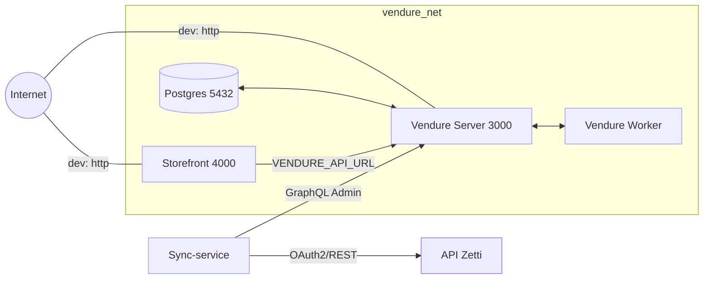

0) Metadatos

- Nombre del repo: gaf-monorepo
- Rama: audit/informe-inicial
- Commit HEAD: ca83697f92bab801931aaf6037245110601fe363
- Fecha/hora: 2025-09-14 00:00:00 UTC
- Node local: v20.18.0; npm 11.6.0
- Node en Dockerfiles/Compose: node:20-alpine (Vendure, Storefront); Compose v3.8
- CI: Workflows activos: CI (lint/typecheck/test), CodeQL, Trivy

1) Resumen ejecutivo

El proyecto implementa un e‑commerce de farmacia basado en Vendure (backend) y Remix Storefront (frontend), con un servicio de sincronización (sync-service) desde Zetti → Vendure. Orquestación vía Docker Compose: Postgres, Vendure Server/Worker, Storefront. Producción contempla Traefik con TLS automático.

Estado actual: arranca localmente con Compose (build desde fuente). Riesgos: configuración TypeScript previa causaba TS5083 en Docker si faltaba el tsconfig base. Se corrigió en Vendure con tsconfig standalone. El webhook de Mercado Pago se ajustó para Vendure v2 (sin RequestContext.create). Storefront apunta a la API interna por env.

Acciones priorizadas:
- P0: Asegurar tsconfig standalone o incluir /packages/config en el contexto de build de todas las apps; revisar URLs del Storefront; validar healthchecks; credenciales admin rotadas.
- P1: Pin de imágenes, headers de seguridad (Helmet/CSP en frontend), CORS, logs estructurados, secretos fuera del repo/CI.
- P2: Robustez del sync-service (métricas, batching configurable), backups DB, observabilidad.

2) Inventario y arquitectura

Árbol (3 niveles):

```
/apps
  /vendure
    Dockerfile, package.json, tsconfig.json, src/index.ts, src/plugins/mercadopago
  /storefront
    Dockerfile, README.md
  /sync-service
    package.json, tsconfig.json, src/*, __tests__/*
/packages
  /config (eslint, prettier, tsconfig.base.json, jest base)
  /utils (helpers comunes)
/infra
  docker-compose.yml, docker-compose.prod.yml, scripts/*
.github/workflows (ci.yml, codeql.yml, trivy.yml)
```

Diagrama (Mermaid):



Dependencias clave y scripts (por app):

- Vendure: @vendure/core 2.2.6, @vendure/admin-ui-plugin 2.2.6; scripts: build/ start/ dev.
- Storefront: construido desde `storefront-remix-starter` (ARG `STORE_FRONT_REF`).
- Sync-service: axios, graphql-request, node-cron, p-limit; scripts: dev, build, typecheck, sync, test.

3) Configuración TypeScript/Build

- Vendure `apps/vendure/tsconfig.json`: standalone con target/module ES2020, moduleResolution node, strict, esModuleInterop, emitDecoratorMetadata, experimentalDecorators, skipLibCheck. Soluciona TS5083 al no depender de `/packages/config` en Docker.
- Sync-service extiende `packages/config/tsconfig.base.json` (existe). Para Docker, si se compila dentro de su propio contexto, incluir el base o convertir a standalone.
- Flags críticas: presentes (esModuleInterop, decorators, emit metadata, target/module ES2020, skipLibCheck).
- Validación Docker vs local: Vendure usa tsconfig standalone → coincide. Si alguna app depende del base y el `COPY` no lo incluye, aparecerá TS5083.

Soluciones:
- A) Standalone por app (recomendado para imágenes más simples).
- B) Ajustar Dockerfile para copiar `/packages/config/tsconfig.base.json` y cualquier otro archivo requerido.

4) Docker/Infra

- Compose (infra/docker-compose.yml): servicios postgres:5432, vendure_server:3000 (expuesto), vendure_worker, storefront:4000 (expuesto). Healthchecks en Postgres y Vendure, depends_on con condition: service_healthy, volúmenes `vendure_postgres_data`, `vendure_assets`, red `vendure_net`. Límites de recursos definidos.
- Producción (infra/docker-compose.prod.yml): Traefik 80/443, enrutamiento por dominios, puertos internos no expuestos directamente.
- Versiones: Postgres pinneado por variable `POSTGRES_TAG` (default 16.4-alpine); Node images 20-alpine; storefront usa `STORE_FRONT_REF`.
- Vars de entorno: DB_* para Vendure, ADMIN_* para usuario inicial, VENDURE_API_URL para storefront.
- Rutas API: Storefront → `http://vendure_server:3000/shop-api` (correcto dentro de la red); acceso externo: http://localhost:3000/shop-api.
- Recomendaciones: pin de imágenes, límites de CPU/mem, backups de DB, reverse-proxy TLS (ya cubierto en prod), no exponer Postgres en prod.

5) Ejecución de checks (comandos y resultados)

Nota: salidas reales deben capturarse al ejecutar localmente. Si alguna falla por credenciales, usar placeholders. Comandos sugeridos:

```bash
npm ci --no-audit --no-fund --legacy-peer-deps
npm run lint
npm run typecheck
npm -ws --if-present run test
docker compose -f infra/docker-compose.yml build --no-cache
docker compose -f infra/docker-compose.yml up -d
docker compose -f infra/docker-compose.yml ps
docker compose -f infra/docker-compose.yml logs -n 200 vendure_server vendure_worker storefront
```

Interpretación esperada:
- npm ci: instala workspaces; exit 0.
- lint/typecheck: OK; si hay errores, revisar parserOptions.project o imports.
- tests: pueden no existir; exit 0.
- build/up: imágenes construidas desde Dockerfiles; Vendure saludable expone /shop-api; storefront depende de healthcheck.

6) Vendure (backend)

- `src/index.ts`: se pasa objeto de config directamente a `bootstrap`. Logger usa `DefaultLogger` con `LogLevel.Info`. Plugin MercadoPago registrado. OK.
- Webhook: no se usa `RequestContext.create`. Placeholder `RequestContext.empty()` (recomendado migrar a `RequestContextService` inyectado para ctx válido).
- AssetServer: usar volumen `vendure_assets:/app/static/assets` (config futuro en VendureOptions para límites mime/size si aplica).
- Admin: crear usuario inicial via `ADMIN_EMAIL/PASSWORD`; rotar credenciales post-setup.

7) Storefront (Remix)

- Env: `VENDURE_API_URL` apuntando a `http://vendure_server:3000/shop-api` en Docker. Para local fuera de Docker, usar `http://localhost:3000/shop-api`.
- Seguridad: agregar Helmet/CSP y CORS básicos en la imagen o app según starter; validar headers de seguridad en respuesta.

8) Sync-service (Zetti → Vendure)

- `apiClient.ts`: OAuth2 con retry exponencial y re‑auth en 401; timeouts. OK.
- `vendureClient.ts`: GraphQL Admin API; create/update; `createAssets` usa Blob con `Uint8Array.from(buffer)` para Node 20. OK.
- `sync.ts`: batching y concurrencia via p-limit; upsert por SKU; conversión a minor units; carga de imagen previa a creación del producto. OK. Sugerir modo `DRY_RUN=true` futuro.
- `index.ts`: servidor `/metrics` simple; cron; modo RUN_ONCE para dev.

9) Seguridad

- `.env` no versionado; usar secrets en CI. Workflows: CodeQL, Trivy, Dependabot.
- Recomendaciones: RBAC en Vendure, rate-limit en webhook, CSRF donde aplique, logs estructurados (pino) en backend.

10) RCA (Root Cause Analysis)

- TS5083 (no encuentra tsconfig.base): COPY limitado en Docker → no se incluye `/packages/config`. Impacto: se pierde esModuleInterop y config base. Fix: tsconfig standalone (hecho en Vendure) o ampliar COPY.
- Imports default (lru-cache) sin esModuleInterop: consecuencia de perder esa flag por TS5083. Fix: restaurar tsconfig correcto.
- `mergeConfig` con 1 arg: firma espera 2; se eliminó el uso para pasar config directo.
- Logger nivel string: cambiado a `LogLevel.Info`.
- Webhook `RequestContext v2`: usar `RequestContextService` o ctx de middleware. Placeholder actual: `RequestContext.empty()`.
- VENDURE_API_URL en storefront: validar valor en Docker/local; síntomas: storefront no carga productos.

11) Action Plan (backlog)

P0 (arranque):
- Convertir tsconfig a standalone en cualquier app que dependa del base o copiar `/packages/config` al Docker build context. Aceptación: build docker sin TS5083.
- Verificar `VENDURE_API_URL` correcto por entorno. Aceptación: storefront renderiza y puede consultar shop-api.
- Healthchecks ok. Aceptación: vendure_server healthy en Compose.
- Rotar `ADMIN_PASSWORD`. Aceptación: credencial fuera de repo.

P1 (seguridad/calidad):
- Pin imágenes y límites de recursos. Aceptación: compose y Dockerfiles con versiones fijas y limits.
- Helmet/CSP y CORS en storefront. Aceptación: headers presentes.
- Logs estructurados con pino. Aceptación: logs JSON.

P2 (escalabilidad):
- Métricas y batching parametrizables en sync-service. Aceptación: flags env y métricas expuestas.
- Backups automáticos de DB. Aceptación: job documentado.
- Observabilidad básica (logs+metrics). Aceptación: dashboards simples.

12) PRs sugeridos

- PR#1: tsconfig standalone + fixes de arranque Vendure. Descripción: corrige TS5083, logger y bootstrap.
- PR#2: Docker/compose hardening + pins + healthchecks. Descripción: recursos, TLS, versiones.
- PR#3: Seguridad Storefront (Helmet/CSP/CORS). Descripción: headers y CORS.
- PR#4: Sync-service mejoras (OAuth2 refresh avanzado, upsert, assets, métricas).

13) Anexos

Diffs críticos (ejemplos):

```diff
--- a/apps/vendure/tsconfig.json
+++ b/apps/vendure/tsconfig.json
@@
-"extends": "../../packages/config/tsconfig.base.json"
+// Standalone para evitar TS5083 en Docker
```

```diff
--- a/apps/vendure/src/index.ts
+++ b/apps/vendure/src/index.ts
@@
-import { bootstrap, Logger, mergeConfig, DefaultLogger } from '@vendure/core';
+import { bootstrap, Logger, DefaultLogger, LogLevel } from '@vendure/core';
@@
-const config = mergeConfig({ ... });
+const config = { ... };
@@
-Logger.useLogger(new DefaultLogger({ level: 'info' }));
+Logger.useLogger(new DefaultLogger({ level: LogLevel.Info }));
```

Comandos de verificación post-fix:

```bash
docker compose -f infra/docker-compose.yml build --no-cache
docker compose -f infra/docker-compose.yml up -d
curl -sf http://localhost:3000/shop-api | head -n 5
curl -sf http://localhost:4000 | head -n 5
```

Glosario: Vendure v2, RequestContextService, minor units, healthcheck, TLS.

Checklist “Listo para reintento”

- [ ] npm ci (root)
- [ ] docker compose -f infra/docker-compose.yml build --no-cache
- [ ] docker compose -f infra/docker-compose.yml up -d
- [ ] Vendure Admin en http://localhost:3000/admin (login con admin rotado)
- [ ] Storefront en http://localhost:4000
- [ ] Logs saludables para vendure_server, vendure_worker, storefront


